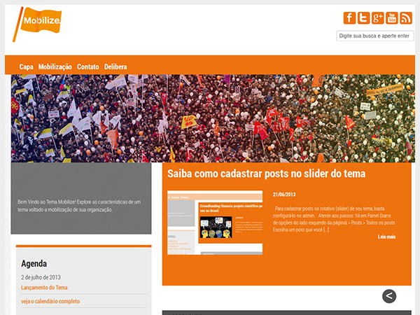

# mobilize

Tema do WordPress desenvolvido pela Rede Livre para projetos de mobilização social (Ex. http://www.sociedadeglobal.org.br)

# capturas

# que e ?

Abordagens sistêmicas e soluções integradas para desafios complexos!
A plataforma da Sociedade Global utiliza diferentes abordagens e formatos para incluir desde técnicos e especialistas até a população em geral (crowd) para fazer parte da criação de soluções.

Nossa abordagem centrada no ser humano e distribuída no ecossistema promove resultados transformadores para as diferentes partes envolvidas.

Por meio do diálogo, empatia e cocriação, transformamos a nós mesmos e nossas relações até chegarmos em um conjunto de soluções para todo o sistema.

1. Modelos de ecossistemas de inovação urbana para a integração de atores no desenvolvimento das cidades

“Indivíduos, organizações e instituições que atuam de forma integrada na oferta e demanda de tecnologias, serviços, produtos e recursos, para realizar ações coletivas de impacto sistêmico”

2. Arranjos de governança democrática com mecanismos e instrumentos para o engajamento cívico

“Diversidade de formas complementares de informação, consulta, envolvimento, colaboração e empoderamento de diferentes públicos da sociedade na análise, proposição e decisão sobre questões de bem comum”

3. Ferramentas de articulação, mobilização e transformação sistêmica para a cocriação de portfólios de soluções

“Portfólio de inovações em políticas públicas, programas, projetos, processos, produtos e serviços que atendem necessidades e demandas profundas da população e do meio ambiente, criando novos fluxos de informação, recursos e capacidades que mudam profundamente as relações, padrões e estruturas de um dado sistema”.
